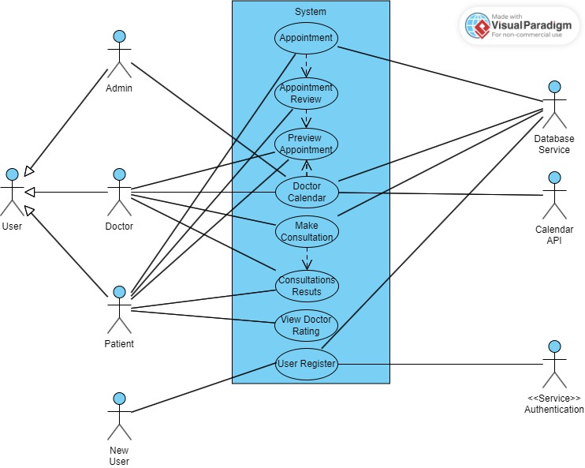

# Requirements

## 1. Appointments List Page
- Future appointments
- Past appointments
- Tab called "Appointments" in the bottom navigation bar

### Appointment creation flow
---
Departments list  
V  
Doctors Cards  
V  
Calendar 30 days (free days green / busy days red)  
V  
List of time slots  
V  
Appointment Details  
V  
Book Appointment  

### Possible features:
---
- Go to next available day

## 2. Post-appointment flow
Doctor feedback - treatment scheme in the documents
Patient feedback - doctor rating